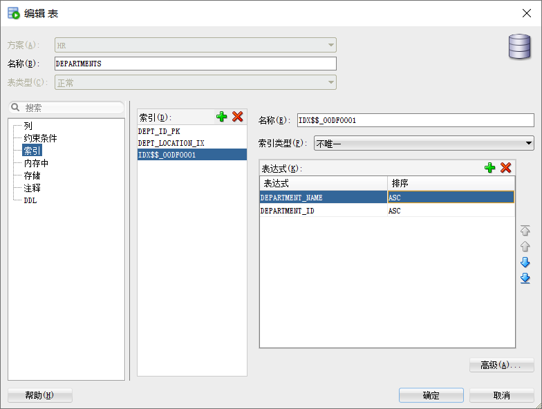

# 第一次实验
## 18软件3班 赵张阳 201810414329

### SQL语句的执行计划分析与优化指导
### 实验目的
### 分析SQL执行计划，执行SQL语句的优化指导。理解分析SQL语句的执行计划的重要作用。

### 实验内容
对Oracle12c中的HR人力资源管理系统中的表进行查询与分析。
首先运行和分析教材中的样例：本训练任务目的是查询两个部门('IT'和'Sales')的部门总人数和平均工资，以下两个查询的结果是一样的。但效率不相同。

我认为最简洁的语句

SELECT d.department_name,count(e.job_id)as "部门总人数",
avg(e.salary)as "平均工资"
from hr.departments d JOIN hr.employees e
on d.department_id = e.department_id
and d.department_name in ('IT','Sales')
GROUP BY d.department_name;

**分析**
通过连接的方式把两张表连接起来再进行查询，会比先查完一张表再根据条件查第二张表快。