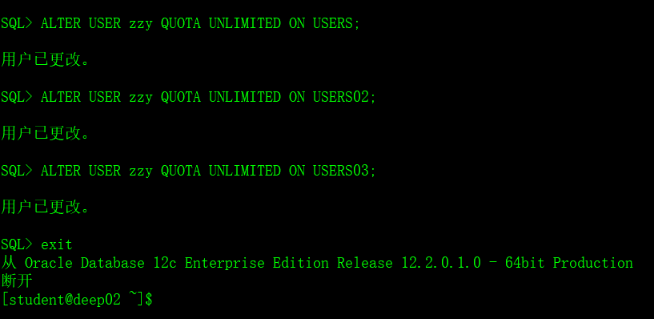
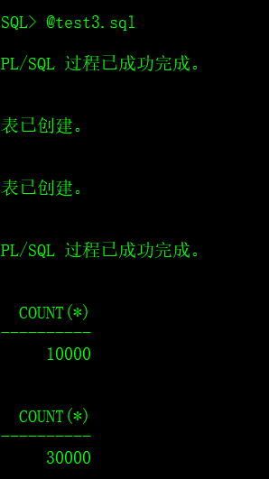
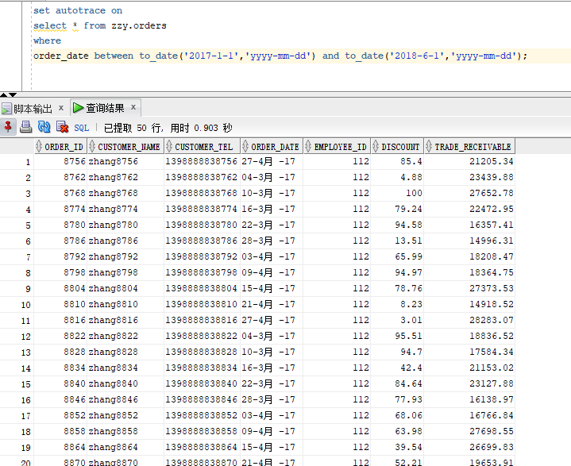
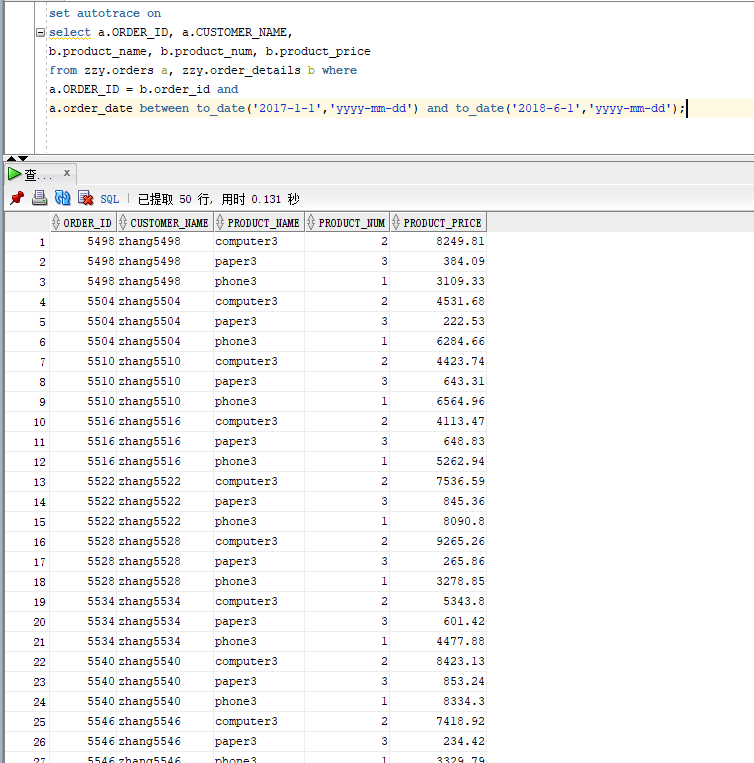
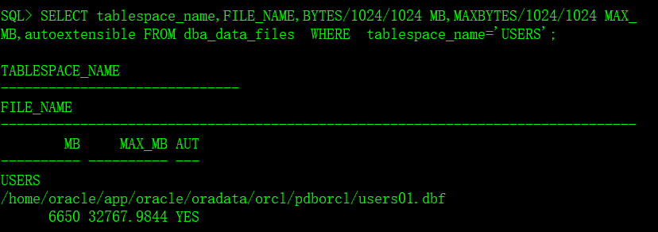
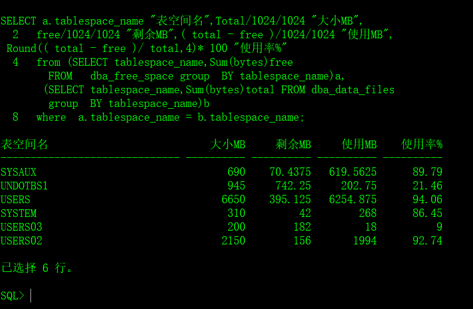

# 实验3：创建分区表

## 软件工程3班 赵张阳 201810414329

## 实验目的

掌握分区表的创建方法，掌握各种分区方式的使用场景。

## 实验内容

- 本实验使用3个表空间：USERS,USERS02,USERS03。在表空间中创建两张表：订单表(orders)与订单详表(order_details)。
- 使用**你自己的账号创建本实验的表**，表创建在上述3个分区，自定义分区策略。
- 你需要使用system用户给你自己的账号分配上述分区的使用权限。你需要使用system用户给你的用户分配可以查询执行计划的权限。
- 表创建成功后，插入数据，数据能并平均分布到各个分区。每个表的数据都应该大于1万行，对表进行联合查询。
- 写出插入数据的语句和查询数据的语句，并分析语句的执行计划。
- 进行分区与不分区的对比实验。

## 实验步骤

- 创建自己的账号

    

- 以自己的账号登录，运行脚本文件test3.sql

    

    

- 在主表orders和从表order_details之间建立引用分区 在study用户中创建两个表：orders（订单表）和order_details（订单详表），两个表通过列order_id建立主外键关联。orders表按范围分区进行存储，order_details使用引用分区进行存储。

```sql
SQL>CREATE TABLESPACE users02 DATAFILE
'/home/student/你的目录/pdbtest_users02_1.dbf'
  SIZE 100M AUTOEXTEND ON NEXT 50M MAXSIZE UNLIMITED，
'/home/student/你的目录/pdbtest_users02_2.dbf' 
  SIZE 100M AUTOEXTEND ON NEXT 50M MAXSIZE UNLIMITED
EXTENT MANAGEMENT LOCAL SEGMENT SPACE MANAGEMENT AUTO;

SQL>CREATE TABLESPACE users03 DATAFILE
'/home/student/你的目录/pdbtest_users02_1.dbf'
  SIZE 100M AUTOEXTEND ON NEXT 50M MAXSIZE UNLIMITED，
'/home/student/你的目录/pdbtest_users02_2.dbf' 
  SIZE 100M AUTOEXTEND ON NEXT 50M MAXSIZE UNLIMITED
EXTENT MANAGEMENT LOCAL SEGMENT SPACE MANAGEMENT AUTO;

SQL> CREATE TABLE orders 
(
 order_id NUMBER(10, 0) NOT NULL 
 , customer_name VARCHAR2(40 BYTE) NOT NULL 
 , customer_tel VARCHAR2(40 BYTE) NOT NULL 
 , order_date DATE NOT NULL 
 , employee_id NUMBER(6, 0) NOT NULL 
 , discount NUMBER(8, 2) DEFAULT 0 
 , trade_receivable NUMBER(8, 2) DEFAULT 0 
) 
TABLESPACE USERS 
PCTFREE 10 INITRANS 1 
STORAGE (   BUFFER_POOL DEFAULT ) 
NOCOMPRESS NOPARALLEL 
PARTITION BY RANGE (order_date) 
(
 PARTITION PARTITION_BEFORE_2016 VALUES LESS THAN (
 TO_DATE(' 2016-01-01 00:00:00', 'SYYYY-MM-DD HH24:MI:SS', 
 'NLS_CALENDAR=GREGORIAN')) 
 NOLOGGING 
 TABLESPACE USERS 
 PCTFREE 10 
 INITRANS 1 
 STORAGE 
( 
 INITIAL 8388608 
 NEXT 1048576 
 MINEXTENTS 1 
 MAXEXTENTS UNLIMITED 
 BUFFER_POOL DEFAULT 
) 
NOCOMPRESS NO INMEMORY  
, PARTITION PARTITION_BEFORE_2017 VALUES LESS THAN (
TO_DATE(' 2017-01-01 00:00:00', 'SYYYY-MM-DD HH24:MI:SS', 
'NLS_CALENDAR=GREGORIAN')) 
NOLOGGING 
TABLESPACE USERS02 
...
);
```

- 以system用户运行，简单查询和联表查询

> 单表查询



> 联表查询



## 查看数据库的使用情况

以下样例查看表空间的数据库文件，以及每个文件的磁盘占用情况。

$ sqlplus system/123@pdborcl

```sql
SQL>SELECT tablespace_name,FILE_NAME,BYTES/1024/1024 MB,MAXBYTES/1024/1024 MAX_MB,autoextensible FROM dba_data_files  WHERE  tablespace_name='USERS';

SQL>SELECT a.tablespace_name "表空间名",Total/1024/1024 "大小MB",
 free/1024/1024 "剩余MB",( total - free )/1024/1024 "使用MB",
 Round(( total - free )/ total,4)* 100 "使用率%"
 from (SELECT tablespace_name,Sum(bytes)free
        FROM   dba_free_space group  BY tablespace_name)a,
       (SELECT tablespace_name,Sum(bytes)total FROM dba_data_files
        group  BY tablespace_name)b
 where  a.tablespace_name = b.tablespace_name;
```

- autoextensible是显示表空间中的数据文件是否自动增加。
- MAX_MB是指数据文件的最大容量。





## 总结体会

通过这次实验，学习了解到分区表的创建方法，学习了各种分区方式的使用场景。

当然，使用分区表的优点也是显而易见的：

​	（1）由于将数据分散到各个分区中，减少了数据损坏的可能性；

​    （2）可以对单独的分区进行备份和恢复；

​    （3）可以将分区映射到不同的物理磁盘上，来分散IO；

​    （4）提高可管理性、可用性和性能。

除此以外也有不足的点：

​	（1）已经存在的表是没有方法可以直接转化为分区表的。